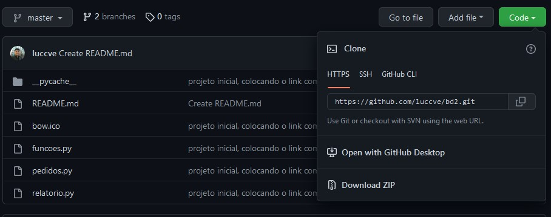

# bd2
<h1>Projeto banco de dados 2</h1>

<h2>Descrição</h2>
<h1 align="center">BANCO DE DADOS 2 PROJETO DE PEDIDOS INTELIGACAO COM SGBD</h1>
<h3 align="center">Para rodar esse projeto só é preciso do python 3+. Existe uma funcionalidade de export pdf que vai ser preciso da instalação da biblioteca reportlab. Caso você use WINDOWS</h3>
    
 ## INSTALAÇÃO NO WINDOWS
 * [PYTHON]
 
Para baixar o python clique <a href="https://www.python.org/ftp/python/3.10.5/python-3.10.5-amd64.exe">aqui</a>

 * [IR PARA A PASTA DO PACKAGES DO PYTHON]
 * [ATUALIZAR O PIP]
  
 pip install --upgrade pip 

 * [INSTALAR O REPORT LAB]
  
pip install reportlab

 
 
## PARA BAIXAR O PROJETO USANDO GIT
 

 <b> comando git clone https://github.com/luccve/bd2.git </b>

## SEMPRE FAÇA O GIT PULL NOME_DA_BRANCH 

 PARA RESGATAR AS ALTERAÇÕES MAIS RECENTES 

  

- Altuamente estamos precisamos de interligar com O SGBD EXTERNO [ALPHABET](https://github.com/luccve/bd2)
- Você vai precisar ter instalado o PostgreSQL: https://www.postgresql.org/download/

<h3 align="left">Connect with me:</h3>

<h3 align="left">Languages and Tools:</h3>

     

  

- Altuamente estamos precisamos de interligar com O SGBD EXTERNO [ALPHABET](https://github.com/luccve/bd2)

 
